# What everything means, with real examples

Every screenshot is a real ranked game, rendered by the actual TagPro client (the
[tagpro-local](https://github.com/BambiTP/tagpro-local) replay viewer) and frozen at the moment
described. Red team's base is usually on the left, blue's on the right. A flag drawn on a player
means that player is carrying it; a faded flag on a tile means that flag's home tile is empty.

How positions are measured: every replay records every player's position and speed four times a
second. Distances in this project are **walking distances** through the map (around walls, not
through them), in tiles.

Contents: [Past N](#past-n) · [Reset](#reset) · [Regrab](#regrab) · [Regrab chain](#regrab-chain) ·
[Anti regrab](#anti-regrab) · [OD and 4OD](#od-and-4od) · [Powerup fight and break-off grab](#powerup-fight-and-break-off-grab) ·
[Bomb gift](#bomb-gift) · [Stalemate](#stalemate) · [Defensive depth: active vs inactive](#defensive-depth-active-vs-inactive-defense) ·
[Other terms](#other-terms)

---

## Past N

**What it means:** how many enemies the flag carrier has gotten past. An enemy is "passed" when the
carrier is closer to the carrier's own flag (where they cap) than that enemy is. Every ball has the
same top speed, so without a boost or bomb, a passed enemy can never get back in front. Past 4 should
be a cap unless the carrier makes a mistake.

**How it's measured:** at every moment, compare the carrier's walking distance to their own flag with
each enemy's. Dead enemies count as passed (they respawn in their own base, away from the carrier's
cap). Boosts and bombs are not counted yet, so this is "past N on foot".

**Past 2** — whiff (blue) runs with red's flag. Two red players are behind him; two are still between
him and blue's flag on the right. Note that both flags are out (xcv, top right, has blue's), so
neither team can cap yet.

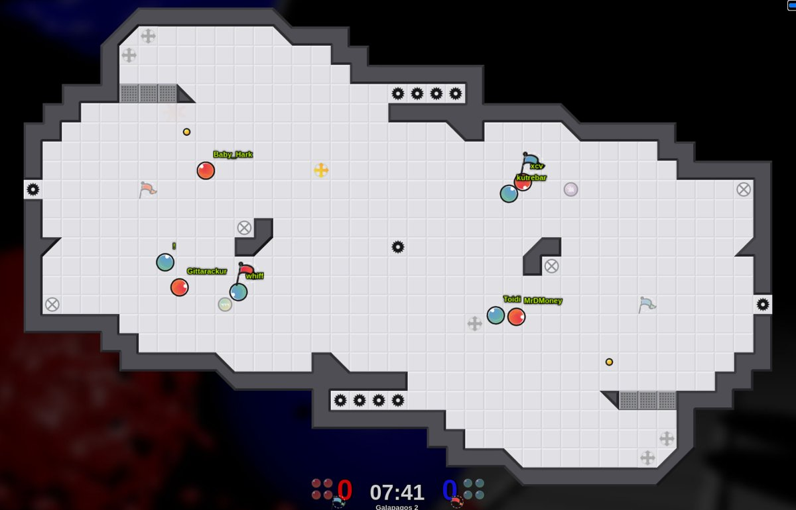

**Past 4** — xcv (red) a split second before capping, carrying blue's flag onto red's flag at the
left. Every blue player is farther from the red flag than he is, so he is past 4, even the two right
next to him.

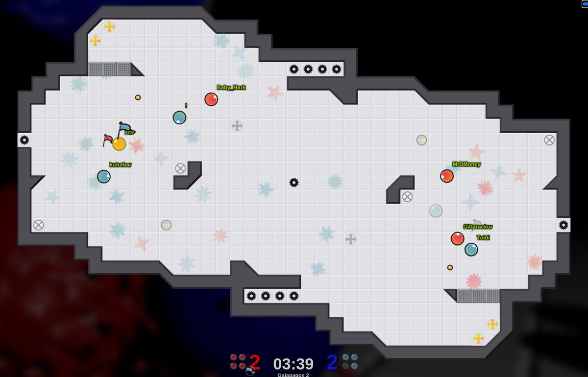

In the data, caps happen almost entirely from past 3 or 4: one second before a cap the carrier is
past 4 in 48% of caps and past 3 in 32%.

---

## Reset

**What it means:** your flag is back home **and** both defenders are back on it. Not just the flag
returning; the defense has to be set again.

**How it's measured:** own flag home, and the team's two defenders alive and within 6 tiles of it.

**Example** — red's flag is home (left) with MrDMoney and Gittarackur back on it while whiff (blue)
comes in to attack. Red is reset. Meanwhile Baby_Hark (red) is carrying blue's flag in the middle.

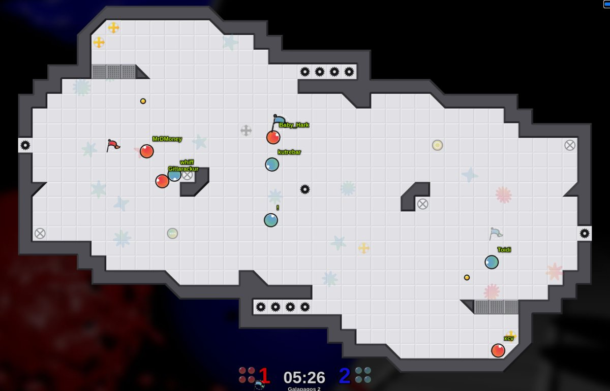

---

## Regrab

**What it means:** while your teammate carries the enemy flag, you wait on the enemy's empty flag
tile. When your carrier is popped, the flag returns instantly to that tile and you grab it straight
back, so your team keeps possession.

**How it's measured:** a team holds the enemy flag and a teammate (not the carrier) is within 2 tiles
of the enemy's empty flag tile.

**Example** — hue (blue, bottom middle) carries red's flag. Destar (blue, top left) waits on red's
empty flag tile; ez (red) sits right next to him, contesting (that is anti regrab, below).

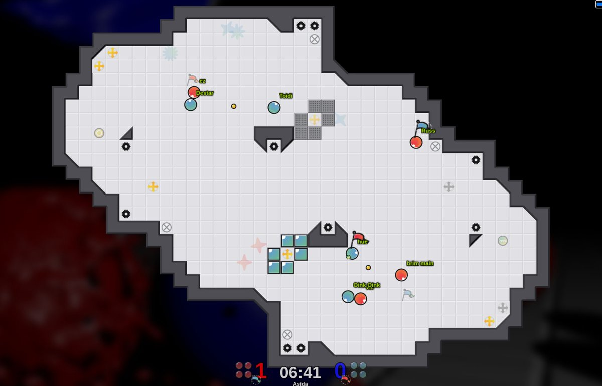

---

## Regrab chain

**What it means:** the regrab actually happening, one or more times in a row: carrier popped, flag
returns, the waiting teammate picks it up.

**How it's measured:** a return of a team's carrier followed within 2 seconds by a grab of the same
flag by the same team.

**Example (two frames, 1.5 s apart)** — Dayman (red) is carrying blue's flag in blue's base (top
right), with Nevermind (red) waiting nearby. Dayman is popped; Nevermind picks the flag straight back
up and now carries it.

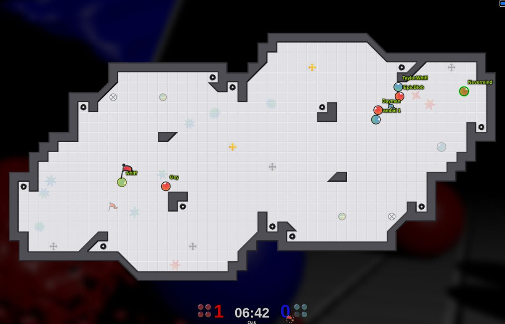
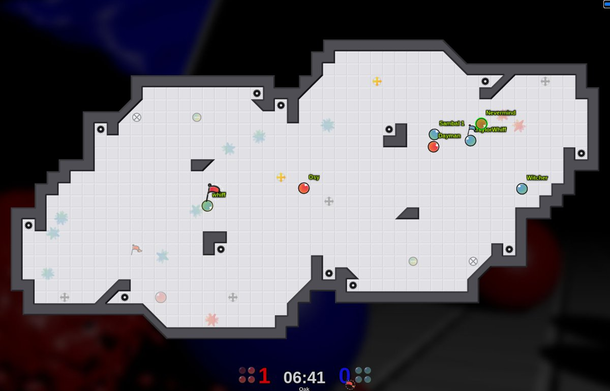

---

## Anti regrab

**What it means:** instead of chasing the carrier or guarding the enemy flag, you block the enemy's
regrab on your own flag tile, so that when their carrier dies nobody is there to pick the flag back
up and their chain breaks. Either keep them off the tile, or pop them the moment the flag returns.

**How it's measured:** the enemy has a regrab waiting on your flag tile and one of your players is
within 3 tiles of that tile.

**Example** — Crasher (blue, top middle) carries red's flag. Hockeypuck (blue, bottom left) waits on
red's empty flag tile; PuyoPuyo (red) is right beside him playing anti regrab.

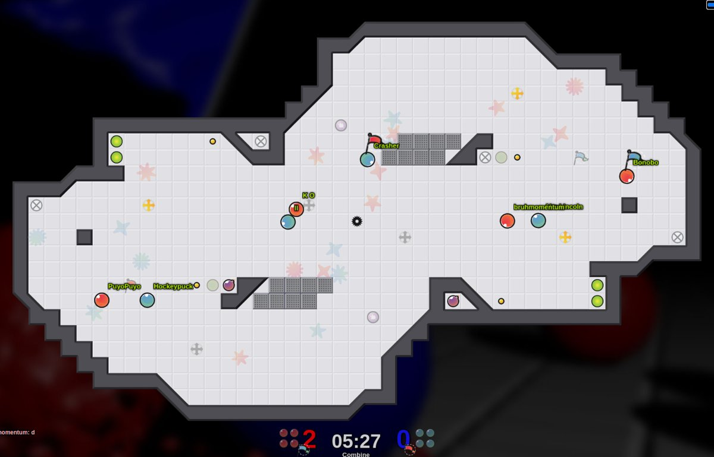

A popped player respawns in their own base, right where the enemy regrab waits, so in the data anti
regrab often starts the moment a player respawns.

---

## OD and 4OD

**What it means:** OD (offense defense): your flag is out, so instead of chasing its carrier you
guard the **enemy's** flag tile, where their carrier has to bring your flag to cap. 4OD is all four
players doing it, used to stall time.

**How it's measured:** your flag is out, the enemy flag is home (otherwise they couldn't cap anyway),
and your players are within 4 tiles of the enemy flag tile.

**Example** — AJ (blue, left middle) carries red's flag. Red has piled its players onto blue's flag
tile at the bottom, so AJ cannot bring red's flag home and cap.

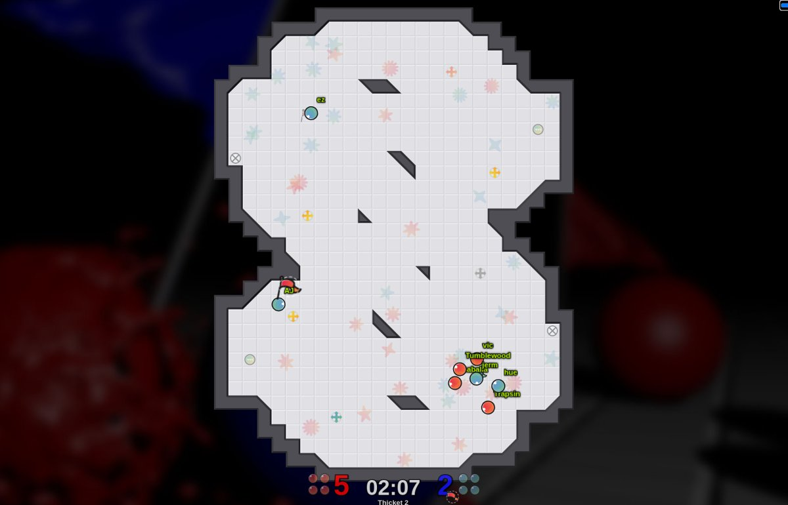

---

## Powerup fight and break-off grab

**What it means:** powerups respawn 60 seconds after they were last taken, and players converge to
fight over them. A break-off grab is a player who stays out of that fight and grabs the enemy flag
while everyone else is distracted.

**How it's measured:** a powerup fight is a powerup respawning with at least 3 players within 5
tiles. A break-off grab is a grab within 5 seconds of that respawn by a player who was not one of the
players at the powerup. (A powerup tile counts down through a 3-second warning before it actually
respawns; only the real respawn counts.)

**Example (two frames, 2 s apart)** — first frame: kutrebar and Chi (blue) are fighting a red
player over the powerup at the bottom. Crab lantern (red, top middle, orange glow = rolling bomb) is
not in the fight. Second frame: Chi has come out with juke juice (green ring), and Crab lantern is
heading onto blue's flag, which he grabs a moment later.

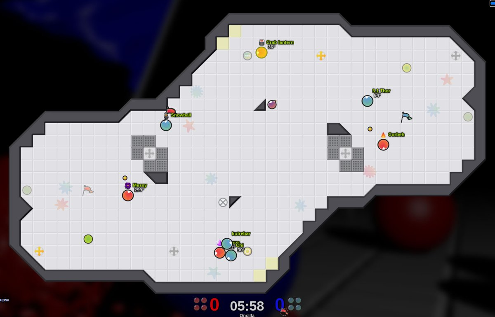
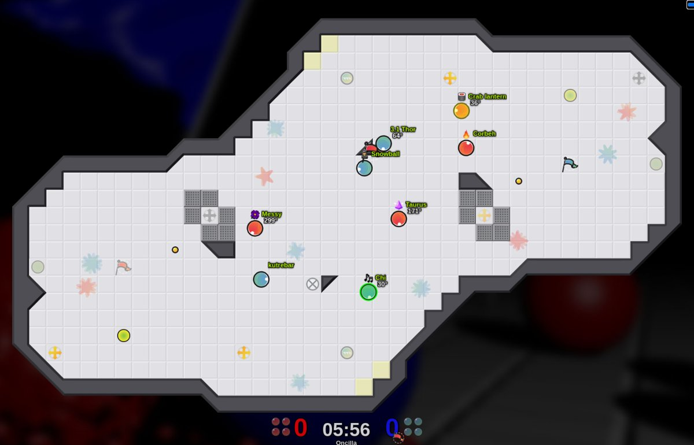

---

## Bomb gift

**What it means:** the user's definition of bomb luck: a bomb throws players who cannot react out of
position, so a carrier gets past them for essentially no reason.

**How it's measured:** a bomb goes off within 3 tiles of at least one enemy of a flag carrier, and
within the next second the carrier's past N goes up because one of those nearby enemies is now
passed. A **free past 4** is a bomb gift that reaches past 4.

**Example (two frames, 1.5 s apart)** — first frame: BallSaget (red, top left) carries blue's flag
with two blue chasers, Kobe Maybe and IPT, right on him, beside a live bomb. Second frame: the bomb
is used up (crossed circle), both chasers have been knocked down and away, and BallSaget is heading
for his flag.

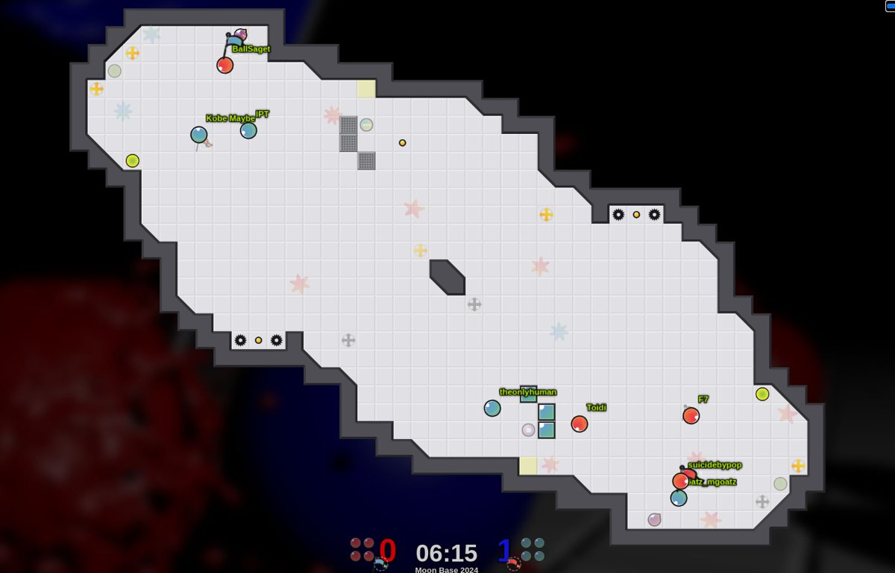
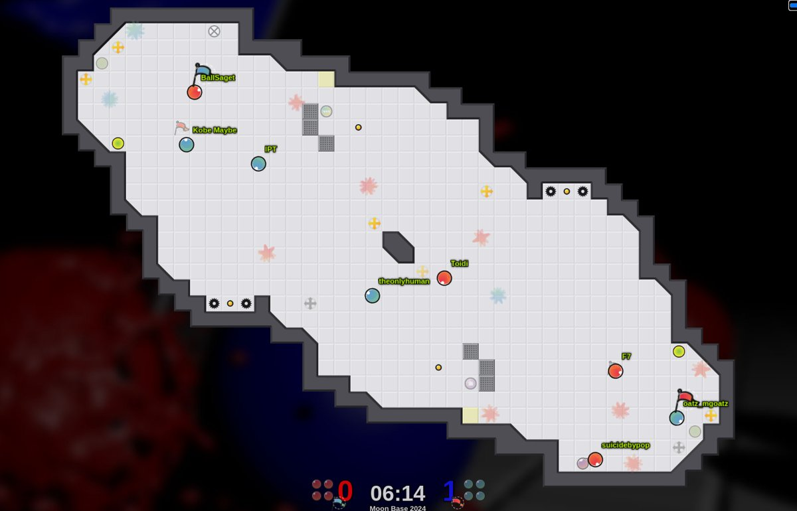

---

## Stalemate

**What it means:** neither team can get a grab and hold it.

**How it's measured:** a stretch of 60 seconds or more in which no grab by either team was held
longer than 4 seconds, with at least 4 grabs attempted (a quiet stretch with no attempts does not
count). By this definition stalemates are rare in ranked: about 2 seconds per game on average.

---

## Defensive depth: active vs inactive defense

**What it means:** the user's distinction. **Active** defense goes out to contest boosts and bombs
and gives the offense no leeway. **Inactive** defense stays near the flag and deflects the offense's
boosts and bombs instead of preventing them.

**How it's measured:** while a team is under attack (its flag home, 2 or more enemies in its half),
the two players closest to their own flag are "the defense" at that moment (ranked teams rotate
roles, so this follows whoever is actually defending). Depth is how far those two sit from the flag,
compared against the average for that map. The 5 seconds before every enemy grab are left out,
because being beaten out of position makes any defense look deep. This is only a stand-in for the
user's distinction, which is about contesting elements; it does capture known styles (below).

**Inactive example: Bambi** (blue, right) sits on blue's flag with Don Garyoni while three red
attackers press in. Over 49 ranked games defending, Bambi plays 0.15 tiles closer to the flag than
the map average (more inactive than 61% of the 742 players measured).

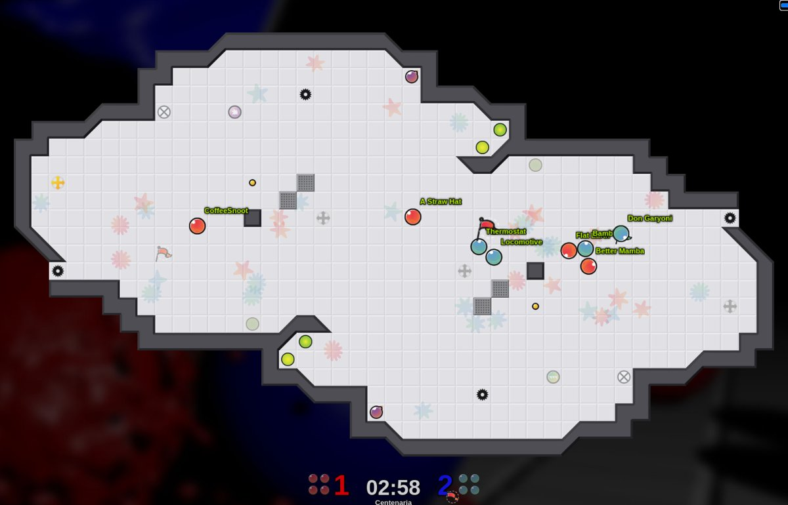

**Active example: Button** (red, top left corner) is out by the bomb and boost about 6 tiles from
red's flag while his partner AJ. holds the flag tile, contesting the elements the blue attackers
(Irony, Toidi) would use. Over 105 ranked games defending, Button plays 0.72 tiles farther out than
the map average (more active than 79% of players), matching his known style.

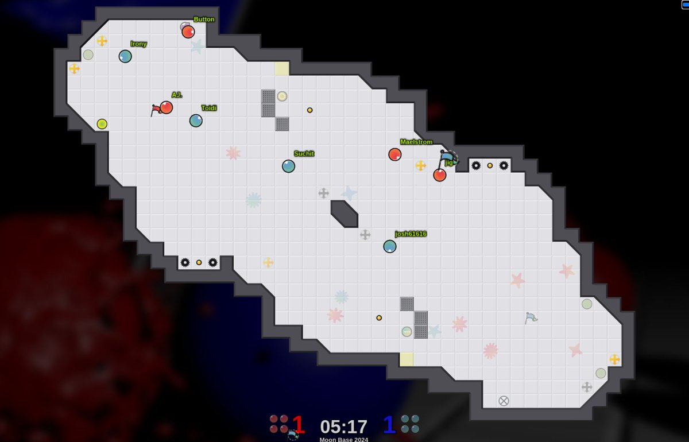

---

## Other terms

| Term | Meaning |
|---|---|
| Cap | Bringing the enemy flag to your own flag while your flag is home. |
| Pop / return / tag | A carrier touched by an enemy pops and the flag returns home. Popping someone is a tag; popping a carrier is a return (also a tag). |
| Hold | Carrying the flag; also how long it is carried. |
| Flaccid | A grab returned within about 3 to 4 seconds. |
| Handoff | A quick regrab chain where the carrier dies fast instead of after a long hold. |
| Kiss / hug | Two carriers touching. In ranked they pop each other (kiss); in competitive play since about 2023-2024 they just bounce (hug, the "no kiss" rule). |
| Pup | Powerup: tagpro (pop anyone by touching), rolling bomb (a shield that explodes instead of you popping, or on demand), juke juice (faster acceleration). |
| Backboard | A teammate behind an enemy defender so the grabber bounces back off the defender instead of following them. |
| Rub grab | Grabbing without elements, using the ~0.25 s of invincibility after a grab to bounce off a defender. |
| Parking the bus | Pulling players back to protect a lead. |
| Rating gap | Our own rating (built from 2.48 million tagpro.eu games) for one team minus the other, from before the game. |
| Log odds | The scale the statistical models work on. Near an even game, +0.1 log odds is about +2.5 percentage points of win chance. |
| Standard error / p | How uncertain an estimate is. An effect about two standard errors from zero (p below 0.05) is unlikely to be chance. |
