# What actually wins TagPro games? A data writeup

Ranked TagPro games record every player's position four times a second. This writeup uses
**10,564 of those replays** (March 2025 to October 2026), **135,000 ranked match records** and
**2.48 million public and ranked games from tagpro.eu** (2015 to 2026) to measure things players
argue about: parking the bus, powerups, luck, defense styles, and whether some players are better on
some maps. Everything here was checked against the real TagPro client, and every result comes with
how confident it is and what could make it wrong.

All clips below are real ranked games, drawn straight from the replay recordings with TagPro's real
textures (positions are the recorded ones, 4 per second, smoothed between). Sharper MP4 versions of
every clip, for posting, are in [videos/](videos/). Full definitions are in
[GLOSSARY.md](GLOSSARY.md); full tables in [FINDINGS.md](FINDINGS.md).

---

## The concepts, in motion

**Regrab chain.** A carrier holds for a while (here 14 seconds), gets returned, and the teammate
waiting on the enemy's empty flag tile grabs it straight back, so the team keeps possession.

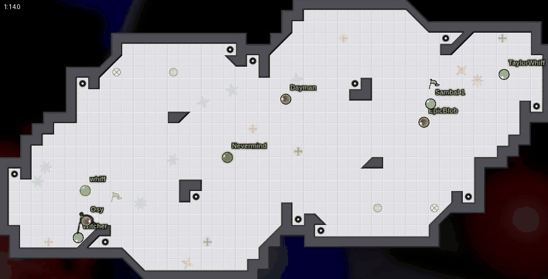

**Handoff.** The same pickup, but the carrier dies quickly, right as the regrab is ready. In the
game's own stats, 96% of handoffs come after a hold under 2 seconds. Here, on OTI Jardim, the blue
carrier goes down and Bambi takes the flag straight off the tile, gets past 2 and holds it for 57
seconds.

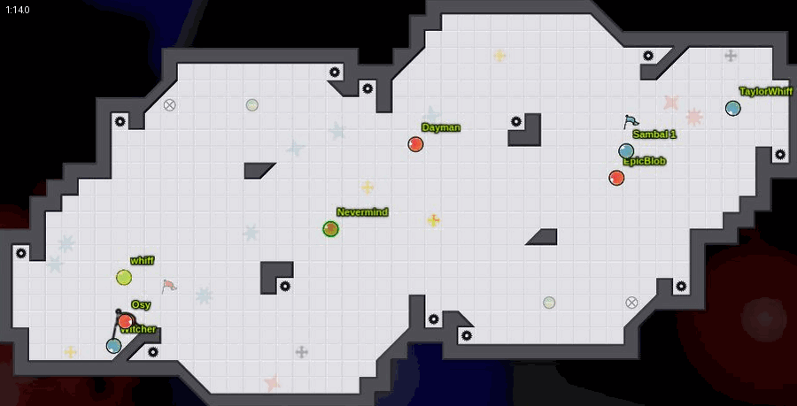

**Past N, to a cap.** Past N is how many enemies the carrier is past: closer to their own flag than
that enemy is, so the enemy can't get back in front without a boost or bomb. Here xcv (red) grabs,
gets past all four, and caps.

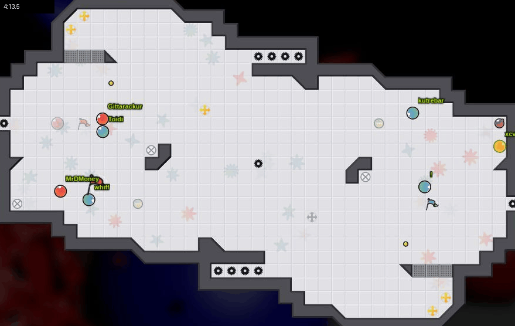

**Bomb gift.** A bomb throws players who can't react out of position, so the carrier gets past them
for essentially no reason. Here BALLDON'TLIE (red) carries blue's flag; a bomb scatters the blue
players around him and he's through.

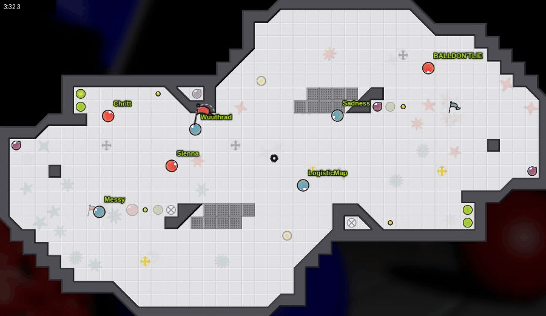

**Powerup fight and break-off grab.** A powerup respawns and players fight over it; someone who stays
out of the fight grabs the enemy flag while everyone is distracted. Here kutrebar and Chi (blue)
fight a red player over the powerup at the bottom, while Crab lantern (red) grabs blue's flag.

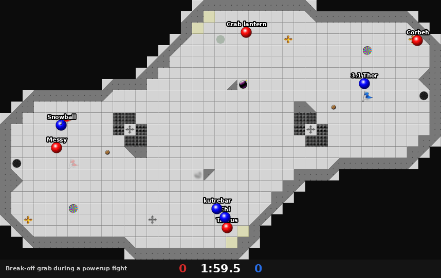

**Anti regrab.** Blocking the enemy's regrab on your own flag tile, so when their carrier dies nobody
is there to pick the flag back up.

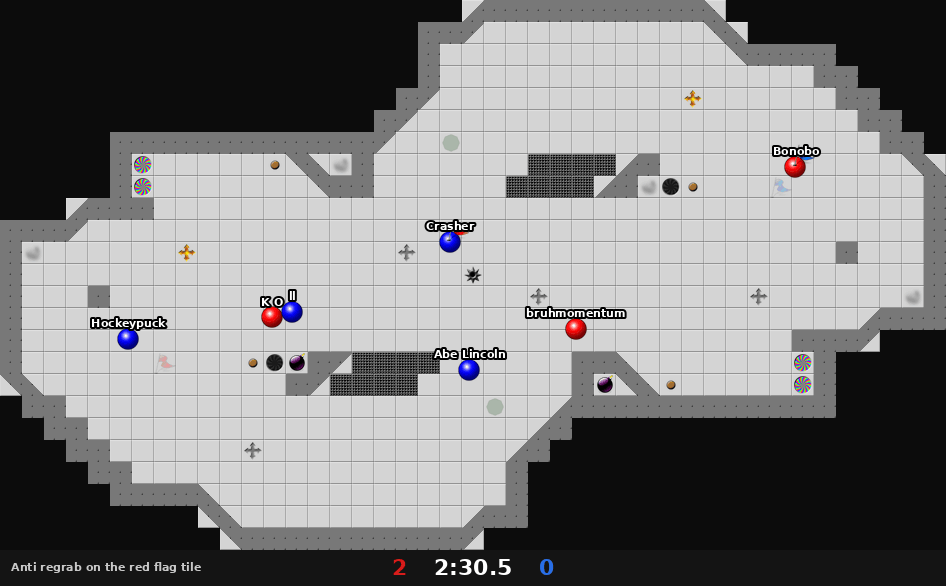

**4OD.** Your flag is out, so your team guards the enemy's flag tile, where their carrier has to
cap.

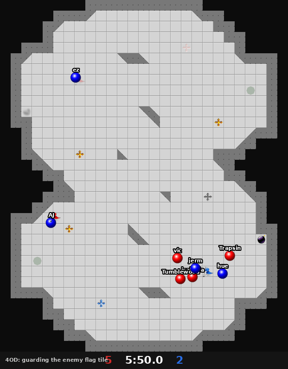

---
## 1. Our own rating beats the ranked matchmaker (solid)

A team rating built from every player's tagpro.eu history (each player's rating taken from before the
game, so the result cannot leak in), tested on 6,421 ranked games:

| Predictor | Picks the winner | Log loss (lower is better; coin flip = 0.6931) |
|---|---|---|
| Ranked matchmaker | 52.7% | 0.6876 |
| Our rating | 58.7% | 0.6680 |

When our rating sees a real gap, the matchmaker had called the game even:

| Games | Stronger team (our rating) won | Matchmaker expected |
|---|---|---|
| All 1,127 with a 100+ point gap | 70.3% | 52.1% |
| The 374 of those in the lowest-rated quarter of games | 73.0% | 50.0% |

Underrated players (experienced players with low ranked ratings) are real and show up most in
low-rated games. An earlier attempt using players' later ranked ratings worked much worse, because
ranked ratings drift between seasons.

---

## 2. Parking the bus hurts the team that does it (solid)

13,959 stretches where a team led. Shape is measured only while both flags were home, as the number
of the leader's players in its own half compared with how that same team played while tied.

| Leader's shape vs when tied (fifth)   |   Lead stretches |   Extra players in own half | Leader won   |   Avg minutes left at start |
|:--------------------------------------|-----------------:|----------------------------:|:-------------|----------------------------:|
| Pushed up most                        |             2792 |                       -0.87 | 85.1%        |                         5.5 |
| Pushed up                             |             2792 |                       -0.4  | 80.2%        |                         5.2 |
| About the same                        |             2791 |                       -0.17 | 76.5%        |                         5.1 |
| Pulled back                           |             2792 |                        0.05 | 73.4%        |                         5   |
| Pulled back most                      |             2792 |                        0.42 | 69.9%        |                         4.7 |

| Model of whether the leader won (effect per extra player pulled back, log odds) | Effect | Standard error |
|---|---|---|
| Time left, lead size, matchmaker probability | -0.93 | 0.05 |
| + our rating gap (8,553 stretches with ratings) | -0.92 | 0.06 |
| + how far the trailing team pushed up | -0.87 | 0.07 |
| Only stretches where the trailing team did not push up (977) | -0.42 | 0.18 |

The last row is the cleanest: the leader's retreat was its own choice, and it still cost games.

Side result (suggestive): when the trailing team pushes extra players forward, the leader wins more
(+0.66 log odds per extra player, standard error 0.07). This fits "changing shape because of the score
hurts whoever does it", but teams that are losing badly also push up out of desperation, so part of it
may be a symptom.

---

## 3. Powerups (suggestive)

10,548 ranked games, each team's pickups compared, controlling for the matchmaker's probability:

| Powerup | Effect of one extra pickup (log odds) | About, in win chance | Team with more of it won |
|---|---|---|---|
| Tagpro | 0.179 (se 0.010) | +4.5 points | 60.5% |
| Rolling bomb | 0.155 (se 0.010) | +3.9 points | 59.1% |
| Juke juice | 0.101 (se 0.010) | +2.5 points | 55.7% |

Tagpro is worth the most, rolling bomb close behind, juke juice about half. "Whoever wins the tagpros
wins" is overstated: the team with more still loses about 4 in 10. These are upper bounds: a team in
control of a game also collects more powerups because it is in control.

---

## 4. Luck by map

### 4a. Bomb luck: Combine has the most (solid as a description)

Bomb gifts (see the glossary) per game, by map, from 10,564 replays:

| Map                   |   Games |   Bombs set off per game |   Bomb gifts per game |   Free past 4s per game | Caps within 10 s of a gift   |   Bomb deaths per game |   Bomb returns per game |
|:----------------------|--------:|-------------------------:|----------------------:|------------------------:|:-----------------------------|-----------------------:|------------------------:|
| Combine               |     687 |                    66.76 |                  5.29 |                    1.05 | 10.5%                        |                   4.31 |                    2.19 |
| Poppy [MM26 Champion] |     193 |                    51.7  |                  4.87 |                    1.04 | 10.4%                        |                   4.95 |                    3.49 |
| Galapagos 2           |     272 |                    53.52 |                  4.88 |                    0.99 | 11.5%                        |                   5.44 |                    1.89 |
| A Flaccid Type Map    |     701 |                    51.6  |                  5.26 |                    0.81 | 10.3%                        |                   3.69 |                    2.05 |
| Willow 2              |     183 |                    53.93 |                  4.11 |                    0.79 | 9.4%                         |                   6.04 |                    2.63 |
| Moon Base 2024        |     929 |                    25.99 |                  2.78 |                    0.74 | 5.8%                         |                   2.23 |                    1.07 |
| Camp Dog              |     161 |                    43.84 |                  3.98 |                    0.73 | 7.1%                         |                   3.75 |                    2.07 |
| Deadlift              |     126 |                    26.06 |                  3.07 |                    0.73 | 5.8%                         |                   1.29 |                    0.52 |
| Shake                 |     481 |                    47.26 |                  4    |                    0.72 | 7.4%                         |                   5.14 |                    3.52 |
| Thicket 2             |     626 |                    26.64 |                  2.34 |                    0.67 | 5.4%                         |                   1.7  |                    0.93 |
| Centenaria            |     820 |                    43.2  |                  4.82 |                    0.61 | 10.5%                        |                   5.02 |                    2.44 |
| Asida                 |     847 |                    42.84 |                  3.99 |                    0.58 | 9.1%                         |                   5.08 |                    2.33 |
| Audacity 2            |     801 |                    27.41 |                  3.22 |                    0.52 | 7.2%                         |                   1.95 |                    0.48 |
| Sardonica             |     638 |                    24.39 |                  2.08 |                    0.52 | 5.5%                         |                   2.97 |                    1.54 |
| OTI MERALD            |     102 |                    22.63 |                  2.06 |                    0.45 | 5.6%                         |                   2.25 |                    0.38 |
| OTI Jardim            |     576 |                    27.15 |                  2.93 |                    0.44 | 6.4%                         |                   2.07 |                    0.45 |
| Milano 2              |     684 |                    24.77 |                  2.1  |                    0.39 | 4.9%                         |                   3.06 |                    1.42 |
| Oncilla               |     468 |                    24.9  |                  2.65 |                    0.34 | 6.1%                         |                   1.24 |                    0.44 |
| Corner Store          |     126 |                    23.32 |                  2.55 |                    0.31 | 4.8%                         |                   1.52 |                    1.13 |
| Basenji               |     594 |                    24.26 |                  2.33 |                    0.29 | 4.2%                         |                   2.31 |                    1.87 |
| Oak                   |     116 |                    24.87 |                  2.78 |                    0.26 | 5.4%                         |                   2.2  |                    1.66 |

Across all maps: 3.5 bomb gifts and 0.62 free past 4s per game; 7.5% of caps come within 10 seconds of a
bomb gift; a free past 4 turns into a cap within 10 seconds 28% of the time. Combine has the most bomb
gifts and free past 4s; Basenji and Oak the fewest.

### 4b. Overall luck, ignoring causes (no verdict)

How strongly our rating gap predicts the winner on each map, 2024 to 2026 only, public and ranked
measured separately (higher = more skill-decided, lower = more luck):

| Map                |   Public games |   Skill effect, public |   Ranked games |   Skill effect, ranked |
|:-------------------|---------------:|-----------------------:|---------------:|-----------------------:|
| Willow 2           |            614 |                  0.469 |            825 |                  0.408 |
| Thicket 2          |            573 |                  0.544 |           1924 |                  0.433 |
| Professor Oak      |            –   |                –       |            907 |                  0.473 |
| Combine            |           1685 |                  0.643 |           1906 |                  0.509 |
| Asida              |           2326 |                  0.495 |           3116 |                  0.539 |
| Milano 2           |           1069 |                  0.49  |           2079 |                  0.554 |
| Centenaria         |           1869 |                  0.747 |           2545 |                  0.572 |
| Sardonica          |           1514 |                  0.441 |           2399 |                  0.574 |
| OTI Jardim         |           2017 |                  0.441 |           1775 |                  0.602 |
| A Flaccid Type Map |            853 |                  0.592 |           2212 |                  0.614 |
| Audacity 2         |           1573 |                  0.671 |           2456 |                  0.617 |
| Basenji            |            511 |                  0.427 |           1443 |                  0.634 |
| Moon Base 2024     |           2157 |                  0.623 |           2929 |                  0.649 |
| Oncilla            |            585 |                  0.677 |           1117 |                  0.682 |
| Shake              |           1036 |                  0.532 |           1213 |                  0.698 |
| Capri              |            715 |                  0.641 |            –   |                –       |
| Crawfish Boil      |           1224 |                  0.702 |            –   |                –       |
| Deadlift           |            595 |                  0.681 |            –   |                –       |
| Flume              |           1044 |                  0.655 |            –   |                –       |
| Galapagos          |           1337 |                  0.76  |            –   |                –       |
| OTI MERALD         |           1399 |                  0.493 |            –   |                –       |
| Oak                |            945 |                  0.718 |            –   |                –       |
| Thicket            |           1794 |                  0.707 |            –   |                –       |
| Transilio          |            697 |                  0.807 |            –   |                –       |
| hopscotch          |            960 |                  0.746 |            –   |                –       |
| tequila redbull    |            827 |                  0.746 |            –   |                –       |

The public and ranked rankings barely agree (correlation 0.21 across the 14 maps with both), so with
500 to 3,000 games per map the ranking is mostly noise. Willow 2 and Thicket 2 lean lucky in both.
Combine is 4th luckiest in ranked but middle in public, and not statistically different from other
maps in either. Two traps had to be removed to get here: comparing across years (the player pool
changed) and mixing ranked with public (ranked teams are balanced, so rating gaps there are more often
the rating's own error).

Worked example of the noise (spotted by the user): Oak and Professor Oak are essentially the same
map, yet they sit at opposite ends of this table. Oak was only played in public games (945, skill
effect 0.72, give or take 0.06) and Professor Oak only in ranked (907, 0.47, give or take 0.09).
Ranked values run lower for measurement reasons, and the ranges are wide; with 26 maps compared, a
pair this far apart is expected by chance. Two versions of one map landing far apart is exactly what
noisy per-map numbers look like.

Bombs can decide moments on Combine without that clearly changing who wins whole games, which is a far
noisier outcome.

---

## 5. Active vs inactive defense (no verdict)

Defensive depth (see the glossary) while under attack, team-games split into fifths:

| Defense depth (fifth)   |   Team-games |   Avg distance from flag (tiles) |   Enemy grabs per minute under attack | Grabs that became caps   | Won   |
|:------------------------|-------------:|---------------------------------:|--------------------------------------:|:-------------------------|:------|
| Most inactive           |         3567 |                             2.45 |                                 16.59 | 18.2%                    | 56.5% |
| Inactive                |         3566 |                             3.1  |                                 15.95 | 18.2%                    | 57.0% |
| Middle                  |         3566 |                             3.59 |                                 15.99 | 18.5%                    | 53.5% |
| Active                  |         3566 |                             4.2  |                                 16.46 | 18.8%                    | 50.1% |
| Most active             |         3566 |                             5.5  |                                 17.92 | 19.3%                    | 46.1% |

That looks like a clear win for inactive defense, but the same game drives both: a team being outplayed
gets pulled out of position. The cleanest test uses each team's defenders' habit from their OTHER
games (742 players with 11 or more games), which cannot be caused by this game:

| Defenders' habit (fifth)   |   Team-games |   Habit (tiles deeper than map average) | Won   |
|:---------------------------|-------------:|----------------------------------------:|:------|
| Most inactive              |         3567 |                                   -0.44 | 50.2% |
| Inactive                   |         3566 |                                   -0.16 | 53.3% |
| Middle                     |         3566 |                                    0.01 | 54.1% |
| Active                     |         3566 |                                    0.2  | 52.7% |
| Most active                |         3567 |                                    0.56 | 53.1% |

No difference: -0.02 log odds per standard deviation more active, standard error 0.02, p = 0.31, with
our rating as the skill control. In ranked, defensive depth is mostly a symptom of how the game is
going, not a style that wins or loses. Limits: depth is only a stand-in for the user's distinction
(contesting vs deflecting elements), and ranked defenders rotate and do not coordinate; competitive
games with fixed defense partners are the better test once those replays are in.

---

## 6. How the strategy detectors were checked

Replays were loaded into the real TagPro client and frozen at moments each detector flagged.
Positions match the client to within about half a tile; across 1,036 caps the carrier touches the
flag exactly when the score changes.

| Detector | First check | Fix | After the fix |
|---|---|---|---|
| Regrab | 2 of 2 right | none | right |
| Anti regrab | 2 right, 1 unclear | frames taken a moment later (respawns) | right |
| 4OD | 2 of 3 right | require the enemy flag to be home | right |
| Break-off grab | 0 of 3 right | count only real powerup respawns (the 3-second warning countdown had inflated powerup fights tenfold, 34 to 3.4 per game) | right |
| Bomb gift | needs before and after frames | none | right |
| Stalemate | every one started at 0:00 | require real grab attempts | rare in ranked |

These are small samples (2 to 4 per detector): they show the detectors are not badly broken, not a
precise accuracy figure.

---

## 7. Do certain players do better on certain maps? (solid: no)

1.2 million player-games (4v4, public and ranked, 2024 on). For each game, our rating gives the chance
the player's team should win; a player's "map edge" is how much more they win than that on one map,
compared with everywhere else. If map edges were real, a player's edge in half their games on a map
would predict their edge in the other half:

| Games per map required | Player-map pairs | Split-half correlation | Share of the spread beyond chance |
|---|---|---|---|
| 40+ | 5,655 | -0.025 | 0% |
| 100+ | 980 | -0.008 | 0% |
| 200+ | 120 | 0.043 | 4% |
| Yardstick: overall over-performance (any map) | 1,301 players | 0.235 | real |

Skill carries across maps; success on a particular map is almost all luck. Apparent "map specialists"
(for example +21 points on one map over 63 games) are what the luckiest of thousands of records look
like by chance.

---

## 8. "Plague offense": Bambi's stealth grabbing

One player, Bambi, plays a style nobody else
really uses (disclosure: Bambi also supplied the game knowledge behind this analysis): on offense, never let the defense get solid contact or push you (grazes are fine), keep
moving around them, and grab when the defense suddenly gets out of position or a teammate blocks a
defender. Success is measured by getting past 2 or holding long, not by caps (caps depend on
everything after the grab and even out).

A stealth grab here means: the enemy flag was in base for the whole approach (so it is not a regrab or
handoff), the player spent the 6 seconds before the grab near the enemy base, and no enemy came within
close-contact range in that time. (An earlier version of this section forgot the flag-in-base rule and
counted regrabs as stealth grabs; the numbers below are corrected.)

**Bambi's two best stealth grabs** (Basenji: past 2, held 16 s; Basenji again: past 2):

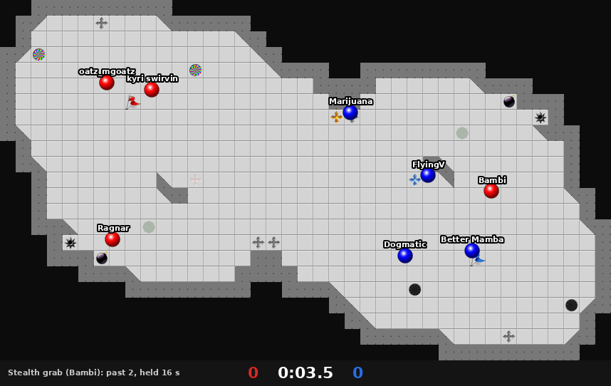
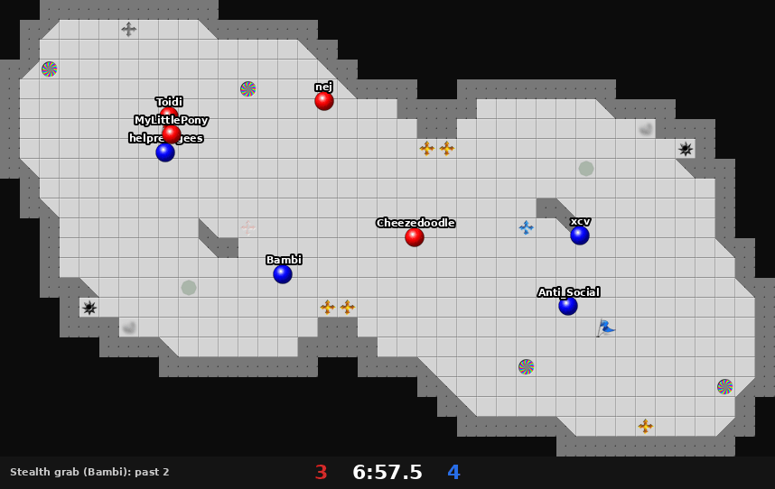

**Two of the best stealth grabs by anyone** (tng. on Thicket 2: held 63 s and capped; hue on Sardonica:
held 57 s and capped):

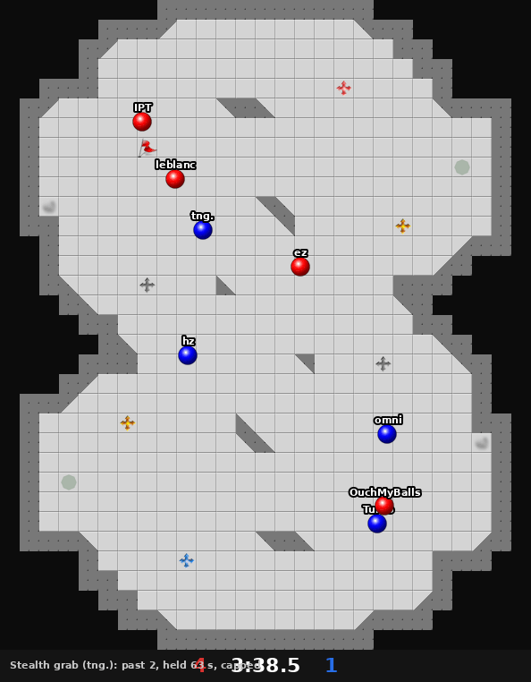
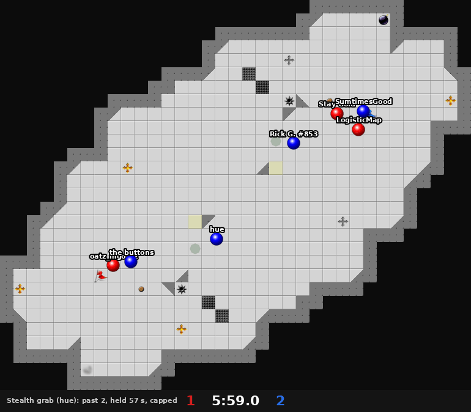

**All players**, grabs made with the flag in base after 6 seconds near the enemy base, by how much close
contact came before the grab:

| Grab type | Grabs | Past 2 within 4 s | Held 10 s+ | Median hold | Capped |
|---|---|---|---|---|---|
| Stealth (no close contact for 6 s) | 10,328 | 66.5% | 16.3% | 3.5 s | 8.3% |
| Some close contact (1-2) | 69,933 | 64.6% | 13.9% | 2.8 s | 7.7% |
| Contact-heavy (3+) | 16,685 | 65.0% | 12.0% | 2.3 s | 6.5% |

Stealth grabs come out slightly ahead on every measure, by small margins. Bambi has only 10 true stealth
grabs in ranked (8 reached past 2 within 4 seconds), too few to judge on their own.

**Where Bambi ranks** (778 to 805 players with enough games; measures fixed before looking, except the
last two, which were added afterwards from the description of the style):

| Measure | Bambi | Median player | Bambi higher than |
|---|---|---|---|
| Spacing from the nearest enemy while attacking | 4.17 tiles | 3.81 | 84% |
| Share of grabs near the base with no close contact for 6 s (before the flag-in-base correction) | 42.6% | 35.6% | 73% |
| Attacking minutes per grab (patience) | 0.275 | 0.251 | 67% |
| Median hold | 5.4 s | 5.0 s | 65% |
| Grabs held 10 s+ | 21.8% | 23.3% | 37% |
| Clear view of a defended flag, within 1-4 tiles | 54.0% of the time | 52.3% | 68% |
| Grabs made from a clear view | 42.2% | 41.1% | 59% |

Bambi leans toward this style without being an extreme outlier on these measures. Their main limit:
positions are recorded 4 times a second, which cannot tell a graze from solid contact at the
few-pixel margins this style works at. The planned fix is to read contacts directly from TagPro's
physics engine while replays play.

---

## Defense styles, in motion

Inactive (Bambi, blue, sits on the flag) and active (Button, red, out by the bomb and boost). Over
their ranked games, Bambi plays 0.15 tiles closer to the flag than the map average and Button 0.72
tiles farther out. The style is clearly measurable; in ranked it does not predict winning either way
yet (section 5).

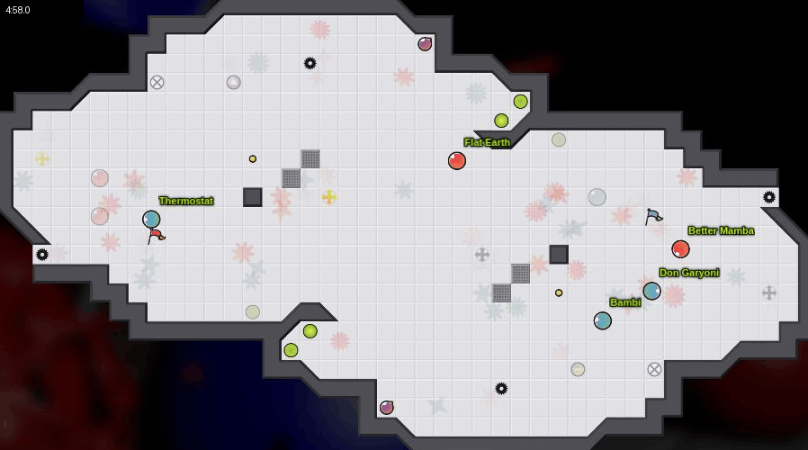
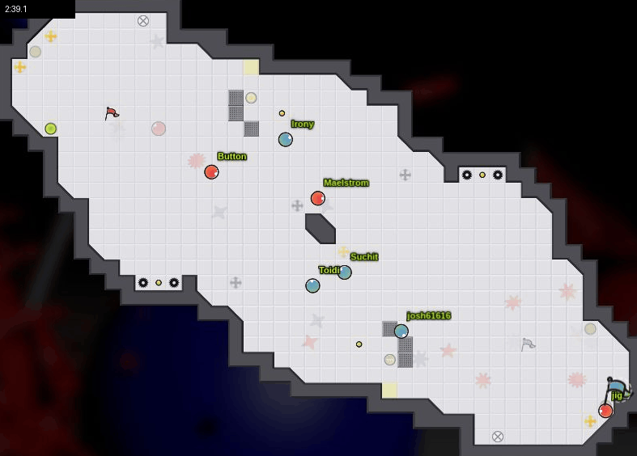

---

## What's next

- **Expected caps:** one model that reads the whole board at any moment and estimates each team's
  chance of capping next, then credits each player for how they move it, so the exact moment of a
  mistake is visible. It will come with a userscript that draws this under the seek bar on
  tagpro.koalabeast.com replays.
- **Solid contact from the physics engine,** to measure plague offense properly.
- **Competitive replays** (about 1,450 of 3,749 downloaded): defense styles with fixed partners, and
  why the no kiss rule made anti regrab less useful.

## Corrections made along the way

- An early version said Basenji was the most skill-decided map. That came from a first, rough
  analysis; the careful one (4b) shows per-map rankings are mostly noise. Only Basenji's low bomb-gift
  count stands.
- Past N could exceed 4 when a player rejoined (a new replay slot counted twice). Fixed before the
  bomb-gift and later results.
